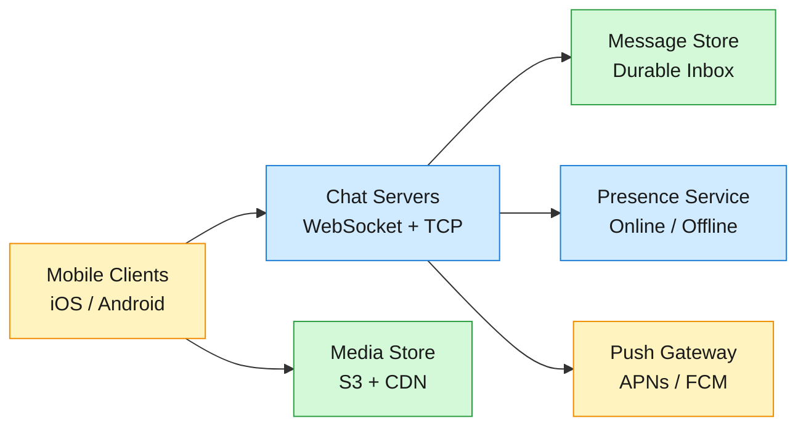
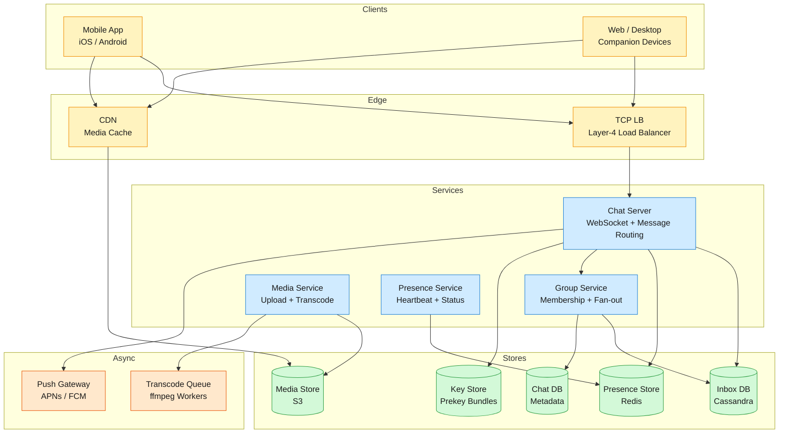

# System Design: WhatsApp

## 1. Problem

WhatsApp is a real-time messaging platform serving 2 billion monthly active users who exchange over 100 billion messages daily — text, images, video, and audio — across unreliable mobile networks worldwide. Every message must be end-to-end encrypted so that no intermediary, including the platform itself, can read it. Messages must reach recipients within one second whether they are online or offline (up to 30 days), and delivery acknowledgements must propagate back to senders reliably. Groups of up to 1,024 members compound the fan-out challenge: a single message in a large group can spawn a thousand delivery operations.



## 2. Requirements

### Functional
- **FR1:** Send and receive text messages in real time.
- **FR2:** Receive messages sent while offline for up to 30 days.
- **FR3:** Create and participate in group chats with up to 1,024 members.
- **FR4:** Send and receive media including images, video, and audio.
- **FR5:** View three-tier delivery status: sent, delivered, and read.
- **FR6:** See when contacts are online, offline, or were last seen.

### Non-functional
- **NFR1:** End-to-end encrypt all messages and media by default.
- **NFR2:** Deliver messages within 1 second at the 99.99th percentile.
- **NFR3:** Support 2 billion monthly active users globally.
- **NFR4:** Operate reliably over unreliable low-bandwidth 2G/3G networks.

**Out of scope:** voice and video calling, status/stories, payments, the business/API platform, and full-text message search.

## 3. Back of the envelope

- 100B messages/day ÷ 86,400 seconds ≈ 1.16M msgs/sec average, peak ~3M/sec → a write-fan-out message to a 1,024-member group would require 3B inbox writes/sec if done synchronously per recipient → the write path is the bottleneck.
- ~1% of messages carry media averaging 1 MB → ~1 PB of new media uploaded daily → media storage dwarfs text by orders of magnitude; the storage layer is the tightest resource.
- Production WhatsApp ran 1M+ concurrent TCP connections per commodity server (Erlang/BEAM, per-process connection model). At 1B DAU with ~50% online concurrently, that is ~500 servers for the real-time tier → connection density is not the limiting factor; the message delivery path drives cost.

## 4. Entities & API

```sql
User {
  user_id:     uuid PK          ← globally unique, shard key
  phone:       string UNIQUE    ← hashed at rest
  display_name:string
  identity_key:blob             ← Curve25519 public key
  prekey_bundle:blob            ← signed pre-key + one-time pre-keys (refreshed by client)
  created_at:  timestamp
}

Message {
  message_id:  uuid PK
  chat_id:     uuid             ← partition key; for 1:1 = sorted(user_a, user_b)
  sender_id:   uuid
  ciphertext:  blob             ← E2E encrypted; server never decrypts
  content_type:enum             ← text | image | video | audio | system
  media_ref:   string?          ← content-hash reference to media store
  client_seq:  bigint           ← per-chat monotonic, set by sender
  created_at:  timestamp
}

InboxEntry {
  user_id:     uuid PK          ← partition key
  device_id:   uuid SK          ← sort key; one entry per device
  message_id:  uuid
  chat_id:     uuid
  global_seq:  bigint           ← global monotonic for efficient reconnect sync (range scan)
  status:      enum             ← pending | delivered | read
  ttl:         timestamp        ← auto-expire after 30 days
}

Chat {
  chat_id:     uuid PK
  chat_type:   enum             ← direct | group
  group_name:  string?
  created_by:  uuid
  created_at:  timestamp
  last_msg_at: timestamp        ← denormalized for inbox sort order
}

ChatMember {
  chat_id:     uuid PK
  user_id:     uuid SK
  role:        enum             ← member | admin
  joined_at:   timestamp
}
```

### API
- `POST /v1/messages` — send a message; returns message_id + server-assigned global_seq
- `GET /v1/inbox?since=<global_seq>&limit=<n>` — sync messages since last acknowledged sequence; returns ordered batch of InboxEntry + Message payloads
- `POST /v1/chats` — create a 1:1 or group chat; returns chat_id
- `GET /v1/chats/<chat_id>/messages?before=<cursor>` — paginated chat history for a loaded conversation
- `POST /v1/media/upload` — request a presigned upload URL; returns upload_url + media_ref (content hash)
- `GET /v1/media/<media_ref>` — download media; 302 redirect to CDN edge with short-lived signed URL
- `WS /v1/ws` — persistent WebSocket for real-time message push, presence events, and delivery receipts

## 5. High-Level Design



### FR1: Send and receive text messages in real time

**Components:** Sender Client → Chat Server (sender-side) → Chat Server (recipient-side) → Recipient Client

**Flow:**
1. Client establishes a persistent WebSocket to a Chat Server via L4 load balancer. On connect, the Chat Server subscribes to the user's pub/sub channel (`user:<user_id>:messages`) in Redis.
2. Sender's client encrypts the plaintext message body using the Double Ratchet-derived message key. The ciphertext is opaque to the server.
3. Sender sends `{"cmd":"send","chat_id":"<id>","ciphertext":"<blob>","client_seq":<n>}` over WebSocket.
4. Chat Server writes a Message row to Cassandra keyed by chat_id, then inserts one InboxEntry per recipient device (partitioned by user_id).
5. The server returns `{"status":"sent","message_id":"<uuid>","global_seq":<n>}` — this is the single-check (✓) receipt.
6. For each online recipient, the Chat Server publishes the message envelope to `user:<recipient_id>:messages` in Redis Pub/Sub. The recipient's Chat Server (subscribed to that channel) receives the publish, looks up the recipient's active WebSocket connections from a local connection map, and pushes the envelope to each device.
7. The recipient's client decrypts the ciphertext and sends a delivery ACK: `{"cmd":"ack_delivery","message_id":"<uuid>"}`. The ACK propagates to the sender's server, which pushes a double-check (✓✓) receipt.

**Design consideration:** Redis Pub/Sub solves the server-to-server routing problem efficiently — each server subscribes only to channels for its currently-connected users, and unsubscribes on disconnect. Pub/Sub is at-most-once, so it is paired with the durable Inbox as the source of truth (see FR2).

### FR2: Receive messages sent while offline for up to 30 days

**Components:** Chat Server → Inbox DB (Cassandra) → Push Gateway → Reconnecting Client → Inbox DB (sync)

**Flow:**
1. When the Chat Server determines a recipient has no active WebSocket connections, it skips the Pub/Sub publish step from FR1.
2. The InboxEntry already written remains with `status = pending` and a TTL of 30 days.
3. The Chat Server triggers a push notification via APNs (iOS) or FCM (Android) — a silent wake-up with badge count increment.
4. When the device reconnects, it sends a sync request: `{"cmd":"sync","last_ack_seq":<global_seq>}`.
5. The Chat Server queries: `SELECT * FROM inbox_entries WHERE user_id = ? AND device_id = ? AND global_seq > ? ORDER BY global_seq ASC LIMIT 500` — a single-partition range scan.
6. The server streams each pending message and awaits delivery ACKs. On ACK, status updates to `delivered`.
7. If the device goes offline mid-sync, the `last_ack_seq` cursor ensures the next sync picks up exactly where it left off.

**Design consideration:** The `global_seq` is a cluster-wide monotonic sequence (e.g., Snowflake). It enables efficient reconnect sync — one range scan per `(user_id, device_id)` restores full state, rather than N-way scatter-gather across every chat the user belongs to.

### FR3: Create and participate in group chats with up to 1,024 members

**Components:** Client → Group Service → Chat Server (fan-out) → Inbox DB → Recipient Chat Servers → Recipient Clients

**Flow:**
1. User A creates a group via `POST /v1/chats` with up to 1,024 members. The Group Service writes Chat + ChatMember rows.
2. On first message, sender generates a Sender Key (symmetric Chain Key + Signature Key pair), encrypts it to each member individually via Double Ratchet (O(N) once).
3. Every subsequent message uses the Chain Key → O(1) symmetric encryption for the group.
4. The Group Service performs server-side fan-out: one InboxEntry per member. Online members get Pub/Sub push; offline get push notification.
5. For groups > ~256 members, hybrid fan-out-on-read: message written once to group feed partition; members fetch on reconnect.

**Design consideration:** Sender Keys reduce per-message encryption from O(N) asymmetric to O(1) symmetric. When a member leaves, all Sender Keys rotate — batched lazily on each sender's next message.

### FR5: View three-tier delivery status: sent, delivered, and read

**Components:** Sender Client → Chat Server (sender) → Chat Server (recipient) → Recipient Client → reverse path for ACKs

**Flow:**
1. **Sent ✓:** Sender's Chat Server acknowledges message persistence → single grey checkmark.
2. **Delivered ✓✓:** Recipient's Chat Server pushes message to at least one device and sends delivery ACK back to sender's server → double grey checkmark.
3. **Read ✓✓ (blue):** Recipient opens the chat, client sends `{"cmd":"ack_read","chat_id":"<id>","up_to_global_seq":<n>}`. Server updates InboxEntry.status to `read` and propagates read receipt → blue double checkmarks.

**Design consideration:** Exactly-once delivery requires client-side deduplication. The sender generates a `client_msg_id` (UUID); the server checks a short-lived dedup cache (Redis, TTL 24h). If the ACK was dropped and client retries, the server returns the original `message_id` + `global_seq`.

## 6. Deep dives

### DD1: Connection routing at scale

**Decision:** Redis Pub/Sub per user channel — each server subscribes ONLY to channels for its currently-connected users. On send: `PUBLISH user:<recipient_id>:messages <envelope>`. No global routing table, no server mesh.

**Rationale:** Battle-tested (Canva scaled Redis Pub/Sub to 100K events/sec at 27% CPU on a single host). Pub/Sub is intentionally at-most-once — an optimization for latency. The Inbox (Cassandra) is the system of record. If Redis drops a publish, the message is already in the recipient's Inbox and delivered on next reconnect sync.

### DD2: Group messaging fan-out

**Decision:** Sender Keys for encryption, server-side fan-out with adaptive write/read threshold.

**Rationale:** WhatsApp uses Sender Keys in production for groups up to 1,024. Median group size < 30 members, so fan-out-on-write is the common case and fast. For large groups, hybrid caps write amplification.

### DD3: Media sharing at planetary scale

**Decision:** Presigned S3 uploads + CDN download + content-addressable deduplication.

**Rationale:** Removes platform servers from the media data path. S3 handles upload bandwidth; CDN handles download. Content addressing (SHA-256 as object key) makes dedup implicit. At 1 PB/day with 60% dedup, stores ~400 TB/day net-new.

### DD4: End-to-end encryption (Signal Protocol)

**Decision:** Signal Protocol — X3DH for asynchronous session establishment, Double Ratchet for per-message forward secrecy.

**Rationale:** X3DH enables E2E encryption without both parties online — critical for asynchronous messaging. Double Ratchet's per-message key derivation means compromising one key reveals only one message. DH ratchet provides post-compromise security — the attacker is "ratcheted out" after one round-trip.

## 7. Trade-offs

| Decision | Trade-off |
|----------|-----------|
| Redis Pub/Sub for routing | At-most-once delivery; requires durable Inbox as source of truth |
| Sender Keys for groups | O(1) encryption vs. key rotation cost on member leave |
| Client-direct media upload | Server loses visibility into upload bandwidth/errors |
| Content-addressed storage | Immutable objects; deleted media requires ref-count GC |
| E2E encryption | No server-side spam/content filtering; no full-text search |
| Global sequence for sync | Gaps when messages skipped; single-partition range scan efficiency |

## 8. References

1. WhatsApp Encryption Overview — Technical Whitepaper
2. Open Whisper Systems: WhatsApp's Signal Protocol Integration Complete
3. Meta Engineering: How WhatsApp Enables Multi-Device Capability
4. Rick Reed, Erlang Factory SF 2012 — Scaling WhatsApp (PDF)
5. Rick Reed, Erlang Factory SF 2013 — Multimedia Galore (PDF)
6. Rick Reed, Erlang Factory SF 2014 — WhatsApp Scaling (PDF)
7. Igors Istocniks, Code BEAM SF 2019 — How WhatsApp Moved 1.5B Users Across Data Centers
8. Designing Data-Intensive Applications (Kleppmann, Ch. 5–6)
9. ByteByteGo: How WhatsApp Handles 40 Billion Messages
